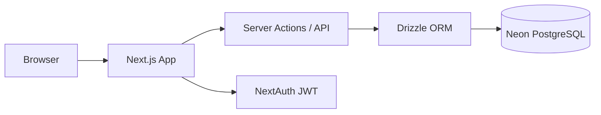

# AasaMedChem — Inventory & Order Management

A hackathon-style inventory and quotation/order system for pharmaceutical supply, built with **Next.js 15**, **Neon PostgreSQL**, and deployable on **Vercel**.

## Live demo

After deploying (see [Deploy to Vercel](#deploy-to-vercel)), add your production URL here and in the Google Form submission.

> **Note:** Deployment requires a Neon database and environment variables. Follow the setup below.

## Features

| Area | Capabilities |
|------|----------------|
| **Auth** | Email/password login with JWT sessions (NextAuth v5). Roles: `admin`, `seller`, `buyer`. |
| **Admin** | CRUD products, stock, low-stock alerts, approve/reject buyer quotations and orders. |
| **Seller** | Fulfillment dashboard — view all buyer orders, verify unit conversions, mark approved orders fulfilled, read-only inventory in all units. |
| **Buyer** | Full catalog with quick quantity presets, live conversion tables (kg↔g, L↔mL), cart, quotations and orders. |
| **Units** | Consistent conversion to canonical base units before pricing and stock checks. |
| **Pricing** | All amounts in **INR**; high-precision `NUMERIC` in Postgres, `decimal.js` in app logic. |

## Tech stack

- **Frontend:** Next.js App Router, React 19, Tailwind CSS 4
- **Backend:** Next.js Server Actions + Route Handlers
- **Database:** Neon serverless PostgreSQL
- **ORM:** Drizzle ORM
- **Auth:** NextAuth.js v5 (Credentials provider)
- **Math:** `decimal.js` for conversions and money (avoids floating-point drift)

### High-level architecture



## Database schema

| Table | Key fields | Types / notes |
|-------|------------|----------------|
| `users` | `email`, `password_hash`, `role` | `admin` \| `seller` enum |
| `products` | `dimension`, `base_unit`, `price_per_base_unit`, `stock_quantity` | See unit strategy below |
| `orders` | `order_number`, `seller_id`, `status`, `total_inr` | Status: quotation → pending → approved/rejected → fulfilled |
| `order_items` | `ordered_quantity`, `ordered_unit`, `quantity_in_base`, snapshots | Denormalized product fields for audit |

Enums: `dimension` (weight, volume, count), `display_unit` (g, kg, mL, L, unit), `order_status`.

## Unit storage & conversion strategy

### Canonical base units (internal storage)

| Dimension | Base unit stored in DB | Allowed order/display units |
|-----------|------------------------|----------------------------|
| Weight | **g** (grams) | g, kg |
| Volume | **mL** (milliliters) | mL, L |
| Count | **unit** (items) | unit (shown as “items”) |

Every product’s `stock_quantity` and `price_per_base_unit` are expressed in its `base_unit` (always the canonical unit for that dimension).

### Conversion factors

| From | To | Factor |
|------|-----|--------|
| 1 kg | g | × 1000 |
| 1 g | kg | ÷ 1000 |
| 1 L | mL | × 1000 |
| 1 mL | L | ÷ 1000 |
| 1 item | item | × 1 |

Implementation: `src/lib/units.ts` using `decimal.js`.

### Where conversions run

1. **On price preview** (`POST /api/calculate-price`): user quantity + unit → base quantity → line INR total.
2. **On place order** (`placeOrder` server action): same conversion; validates stock in base units; persists `ordered_*` and `quantity_in_base` on each line.
3. **On display** (admin order detail): shows both “ordered” and “in base” for verification.
4. **Not** applied to list prices in DB — only at calculation/display time.

### Prices & quantities — PostgreSQL types

| Field | Type | Rationale |
|-------|------|-----------|
| `price_per_base_unit` | `NUMERIC(24,10)` | Up to 14 integer digits + 10 decimal places for fine-grained API/solvent pricing |
| `stock_quantity`, `ordered_quantity`, `quantity_in_base` | `NUMERIC(24,8)` | Large batches (e.g. millions of capsules) with fractional precision |
| `total_inr`, `line_total_inr` | `NUMERIC(24,4)` | Money totals rounded to 4 decimal places at persist time |
| Line totals in app | `ROUND_HALF_UP` to 4 dp before insert | Consistent with INR display (2–4 dp in UI) |

## Test credentials

| Role | Email | Password | Portal |
|------|-------|----------|--------|
| Admin | `admin@aasamedchem.demo` | `admin123` | `/admin` |
| Seller | `seller@aasamedchem.demo` | `seller123` | `/seller` |
| Buyer | `buyer@aasamedchem.demo` | `buyer123` | `/buyer` |
| Buyer 2 | `buyer2@aasamedchem.demo` | `buyer123` | `/buyer` |

## Local setup

### Prerequisites

- Node.js 20+
- A [Neon](https://neon.tech) project (free tier is fine)

### 1. Clone and install

```bash
git clone <your-repo-url>
cd Assamedchem   # or your clone folder name
npm install
```

### 2. Environment variables

Copy `.env.example` to `.env.local` (**required** — Next.js does not read `.env.example`):

```bash
cp .env.example .env.local
# Windows PowerShell:
Copy-Item .env.example .env.local
```

Fill in:

- `DATABASE_URL` — Neon connection string (Pooled connection recommended for serverless).
- `AUTH_SECRET` — run `openssl rand -base64 32` (sign-in fails without this)
- `AUTH_URL` and `NEXTAUTH_URL` — `http://localhost:3000` (use the port shown by `npm run dev`, e.g. 3001 if 3000 is busy)

### 3. Database migration

Apply the SQL migration to Neon (SQL Editor or `psql`):

```bash
# Option A: paste drizzle/0000_init.sql into Neon SQL Editor

# Option B: push schema with Drizzle (requires DATABASE_URL)
npm run db:push
```

### 4. Migrate (if upgrading from seller-only schema)

```bash
npm run db:migrate-buyer
```

### 5. Seed demo data (20 products, sample orders)

```bash
npm run db:seed
```

### 6. Run dev server

```bash
npm run dev
```

**Windows + OneDrive:** If you see `EINVAL: invalid argument, readlink` on `.next`, run a clean start (build cache lives in `node_modules/.cache/next`, not `.next`):

```powershell
npm run dev:clean
```

Open [http://localhost:3000](http://localhost:3000).

## Usage guide

### Admin panel (`/admin`)

1. **Dashboard** — product count, open orders, low-stock warnings.
2. **Products** — create/edit products; set dimension (sets base unit automatically), price per base unit, stock in base units.
3. **Orders** — open any order to see ordered unit vs base quantity and INR math; approve quotations (deducts stock), reject, or mark fulfilled.

### Buyer portal (`/buyer`)

1. **Catalog** — search/filter; **quick quantity** chips (100 g, 1 kg, 5 L, …).
2. Pick any supported **unit**; see **conversion breakdown** table (ordered unit → base unit → INR).
3. **Cart** shows each line converted to base storage units.
4. **Request quotation** or **place order** (buyers only).
5. **My orders** — view conversion details per line.

### Seller portal (`/seller`)

1. **Dashboard** — pipeline of buyer orders.
2. **Buyer orders** — open details to verify kg/g, L/mL conversions and INR math.
3. **Inventory** — read-only stock and rates in all units.
4. **Mark fulfilled** on admin-approved orders.

## Deploy to Vercel

1. Push the repo to GitHub.
2. Import the project in [Vercel](https://vercel.com).
3. Set environment variables: `DATABASE_URL`, `AUTH_SECRET`, `NEXTAUTH_URL` (your `https://*.vercel.app` URL).
4. Deploy; then run seed against production DB once (locally with prod `DATABASE_URL` or a one-off script).
5. Apply `drizzle/0000_init.sql` to production Neon if not using `db:push`.

## Project structure

```
src/
  app/              # Routes (admin, seller, login, API)
  components/       # UI and feature components
  db/               # Drizzle schema + client
  lib/
    units.ts        # Conversion & INR formatting
    actions/        # Server actions
  scripts/seed.ts   # Demo users & products
drizzle/0000_init.sql
```

## Git workflow

Commits are grouped by concern (scaffold, schema, auth, admin UI, seller flow, docs) for reviewability.

## License

MIT — submission for AasaMedChem recruitment assessment.
